# Userscripts

A collection of browser userscripts that add download tools, interface improvements, and useful metadata to popular websites including GitHub, Greasy Fork, YouTube, X/Twitter, Sketchfab, Spotify, GameBanana, and more.

## Installation

Install a userscript manager such as [Tampermonkey](https://www.tampermonkey.net/) or [Greasemonkey](https://www.greasespot.net/), then select **Install** beside any script below. Each link loads the `.user.js` file directly from this GitHub repository and opens your userscript manager's installation prompt.

> [!NOTE]
> Browsers cannot install a userscript manager automatically from a README link. If an install link displays source code instead of an installation prompt, install or enable a userscript manager first.

## Table of Contents

- [General Scripts](#general-scripts)
  - [Adobe Fonts Downloader](#adobe-fonts-downloader)
  - [Filecrypt Unlocker](#filecrypt-unlocker)
  - [Font Awesome Pro Downloader](#font-awesome-pro-downloader)
  - [GameBanana SSBU Install Button Remover](#gamebanana-ssbu-install-button-remover)
  - [Sketchfab Model Ripper](#sketchfab-model-ripper)
  - [SpotubeDL - Spotify Downloader](#spotubedl---spotify-downloader)
  - [Superhivemarket Downloader](#superhivemarket-downloader)
  - [Twitter/X Media Batch Downloader](#twitterx-media-batch-downloader)
  - [Vimm's Lair Download Button Restorer](#vimms-lair-download-button-restorer)
  - [YouTube Direct Downloader](#youtube-direct-downloader)
  - [YouTube Error Auto-Refresh](#youtube-error-auto-refresh)
- [GitHub Scripts](#github-scripts)
  - [GitHub Code Language Icons](#github-code-language-icons)
  - [GitHub File Downloader](#github-file-downloader)
  - [GitHub Folder Downloader](#github-folder-downloader)
  - [GitHub Image Previewer](#github-image-previewer)
  - [GitHub IDE Preview](#github-ide-preview)
  - [GitHub Profile Icon](#github-profile-icon)
  - [GitHub Gist Link](#github-gist-link)
  - [GitHub Gist Copier](#github-gist-copier)
  - [GitHub Join Date](#github-join-date)
  - [GitHub Top Languages](#github-top-languages)
  - [GitHub Repo Age](#github-repo-age)
  - [GitHub Commit File Downloader](#github-commit-file-downloader)
  - [GitHub Repo Size](#github-repo-size)
  - [GitHub Release Downloads](#github-release-downloads)
- [Greasy Fork Scripts](#greasy-fork-scripts)
  - [Greasy Fork Stats](#greasy-fork-stats)
  - [Greasy Fork Update Checks](#greasy-fork-update-checks)
  - [Greasy Fork Script Icon](#greasy-fork-script-icon)
  - [Greasy Fork Code Copier](#greasy-fork-code-copier)
  - [Greasy Fork No Dark Mode](#greasy-fork-no-dark-mode)
  - [Greasy Fork User Profile ZIP Downloader](#greasy-fork-user-profile-zip-downloader)

## General Scripts

#### Adobe Fonts Downloader

Adds a button for downloading fonts from Adobe Fonts.

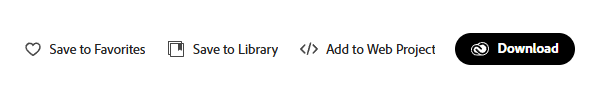

#### Filecrypt Unlocker

Automatically decrypts and displays links from Filecrypt containers.

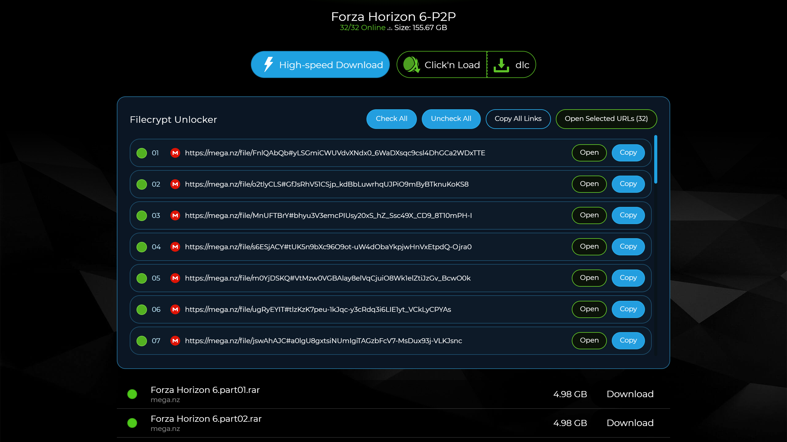

#### Font Awesome Pro Downloader

Adds download and copy buttons for Font Awesome Pro icons.

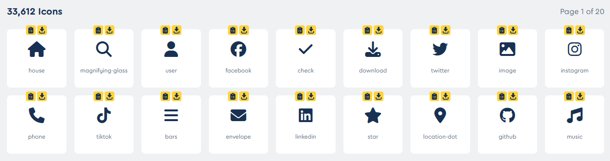

#### GameBanana SSBU Install Button Remover

Removes the FightPlanner 1-Click Install button from GameBanana SSBU mod pages while leaving standard download options intact.

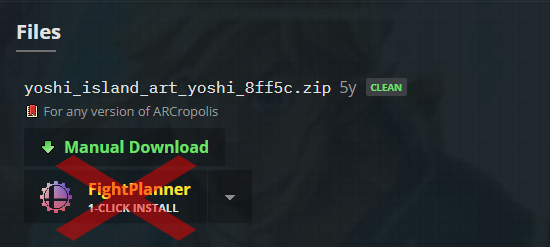

#### Sketchfab Model Ripper

Adds a model download control to Sketchfab viewers and packages captured geometry and original-quality textures together as a single ZIP archive.

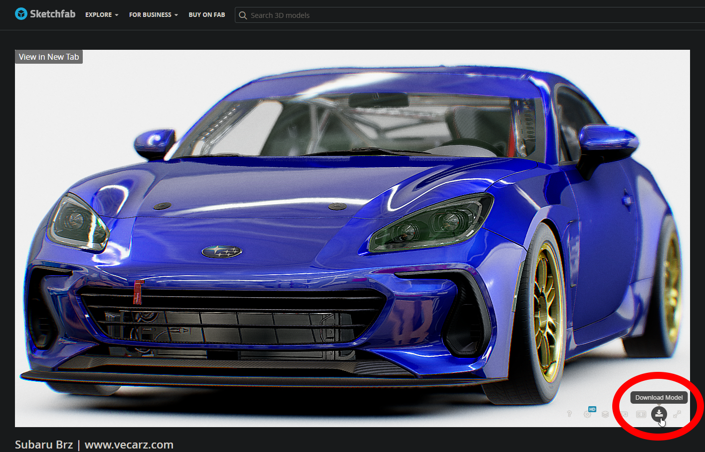

#### SpotubeDL - Spotify Downloader

Adds download controls to Spotify for saving tracks, albums, and playlists through SpotubeDL in MP3, OGG, or Opus formats.

#### Superhivemarket Downloader

Adds CGDownload and GFXCamp buttons for downloading items from Superhivemarket.

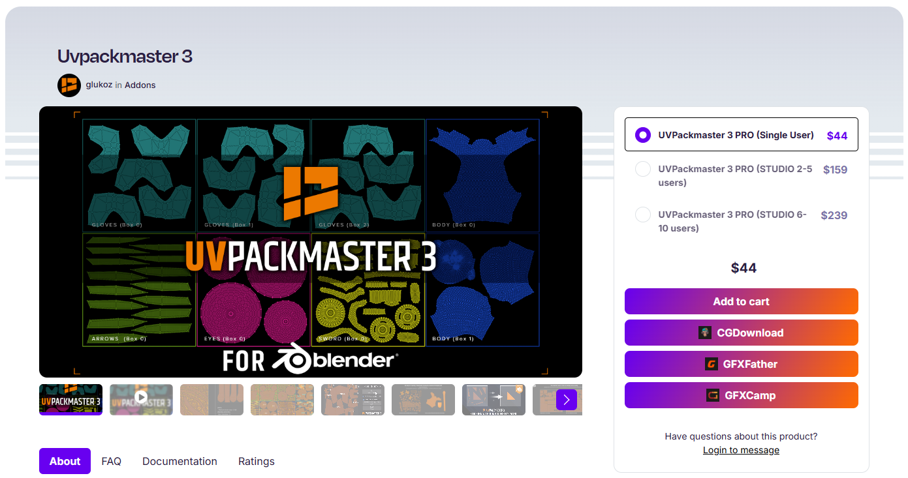

#### Twitter/X Media Batch Downloader

Batch-downloads original-quality images and videos from X/Twitter accounts, including withheld accounts.

#### Vimm's Lair Download Button Restorer

Restores the missing download button on supported Vimm's Lair Vault pages.

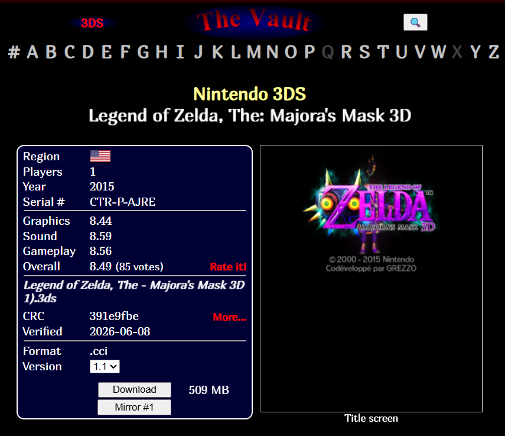

#### YouTube Direct Downloader

Adds a **Download** button to YouTube for saving video or audio directly from the page. Supports watch pages, Shorts, and bulk downloads from a selected channel.

#### Watch Page

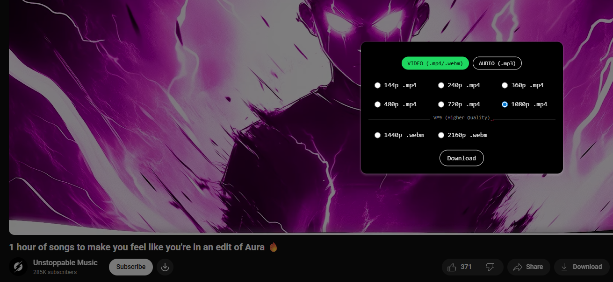

#### Bulk Mode

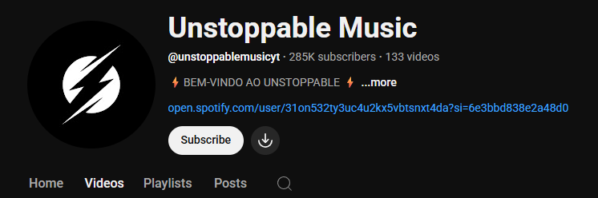

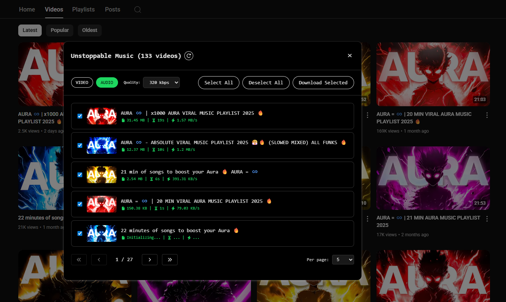

#### Shorts

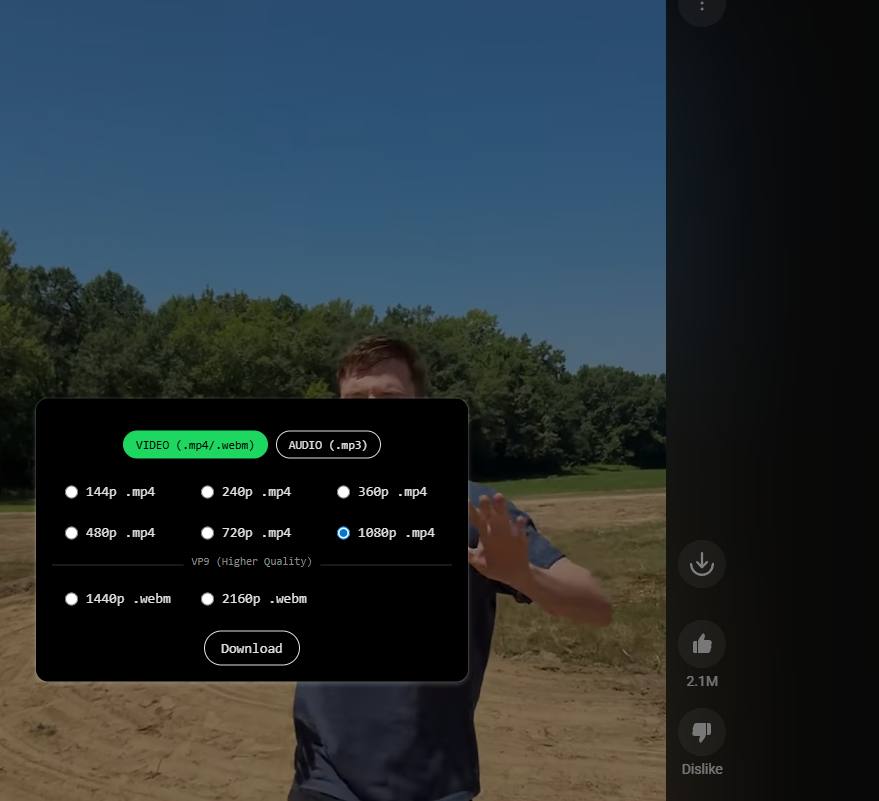

#### YouTube Error Auto-Refresh

Automatically reloads YouTube watch pages when the player reports that content is unavailable. Includes cooldown and reload limits to avoid refresh loops.

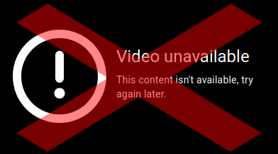

---

## GitHub Scripts

  

#### GitHub Code Language Icons

Replaces GitHub's plain code-language dots with Material Design Icons.

Icons are based on the [Material Icon Theme](https://github.com/material-extensions/vscode-material-icon-theme).

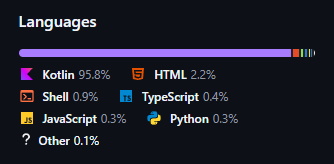

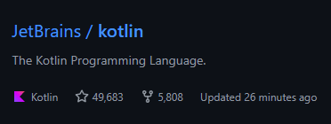

#### GitHub File Downloader

Adds controls for downloading individual files directly from GitHub repository pages.

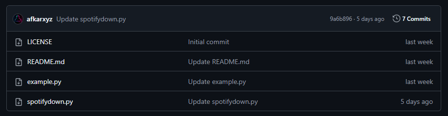

#### GitHub Folder Downloader

Adds controls for downloading individual subfolders from GitHub repository pages.

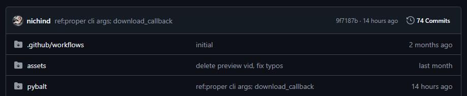

#### GitHub Image Previewer

Previews JPG, PNG, GIF, BMP, TIFF, WebP, SVG, and ICO files directly on GitHub.

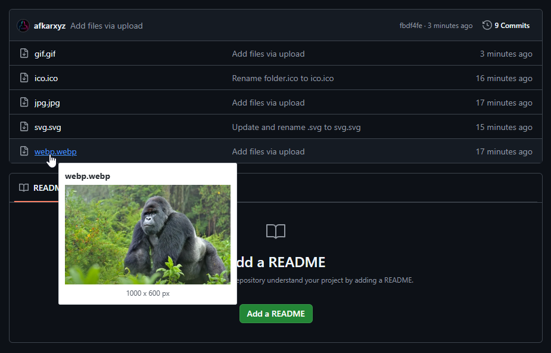

#### GitHub IDE Preview

Adds a **Preview** button to repositories for opening them in [github1s.com](https://github1s.com/) with an IDE-style interface.

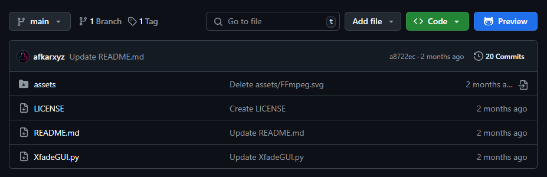

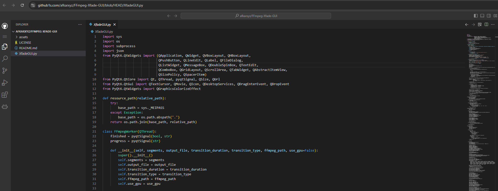

#### GitHub Profile Icon

Adds a clickable icon that identifies whether a profile belongs to a person or an organization.

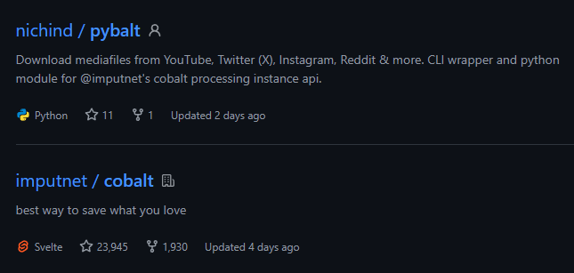

#### GitHub Gist Link

Adds a direct Gist link to GitHub profile pages.

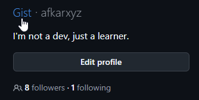

#### GitHub Gist Copier

Adds a copy button to Gist files for quick code copying.

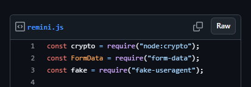

#### GitHub Join Date

Displays a user's account creation date, time, and age.

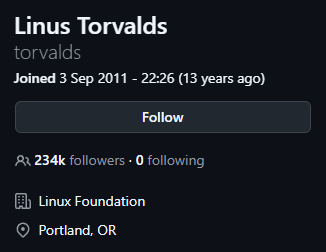

#### GitHub Top Languages

Displays the most-used programming languages on user and organization profiles.

#### User Profile

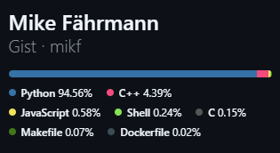

#### Organization Profile

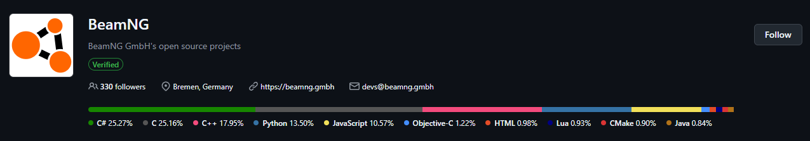

#### GitHub Repo Age

Displays a repository's creation date, time, and age.

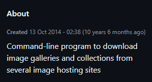

#### GitHub Commit File Downloader

Downloads individual changed files or all changed files as a ZIP directly from commit pages.

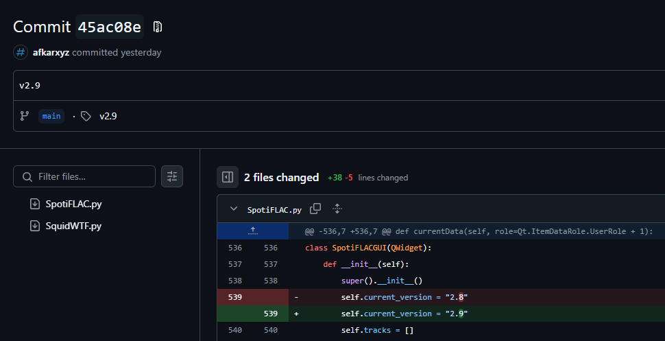

#### GitHub Repo Size

Displays repository sizes directly on GitHub.

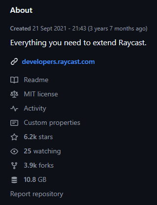

#### GitHub Release Downloads

Displays the total download count across a repository's releases.

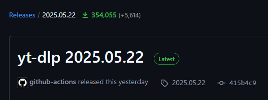

---

## Greasy Fork Scripts

  

#### Greasy Fork Stats

Displays total scripts, installs, and version counts for users on Greasy Fork and Sleazy Fork.

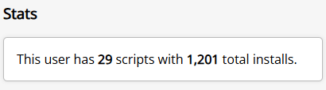

#### Greasy Fork Update Checks

Displays today's script installations and update checks.

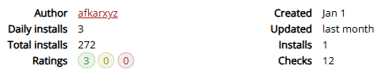

#### Greasy Fork Script Icon

Displays each script's favicon in Greasy Fork and Sleazy Fork listings.

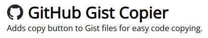

#### Greasy Fork Code Copier

Adds a copy button to script code pages.

#### Greasy Fork No Dark Mode

Disables dark mode on Greasy Fork and Sleazy Fork.

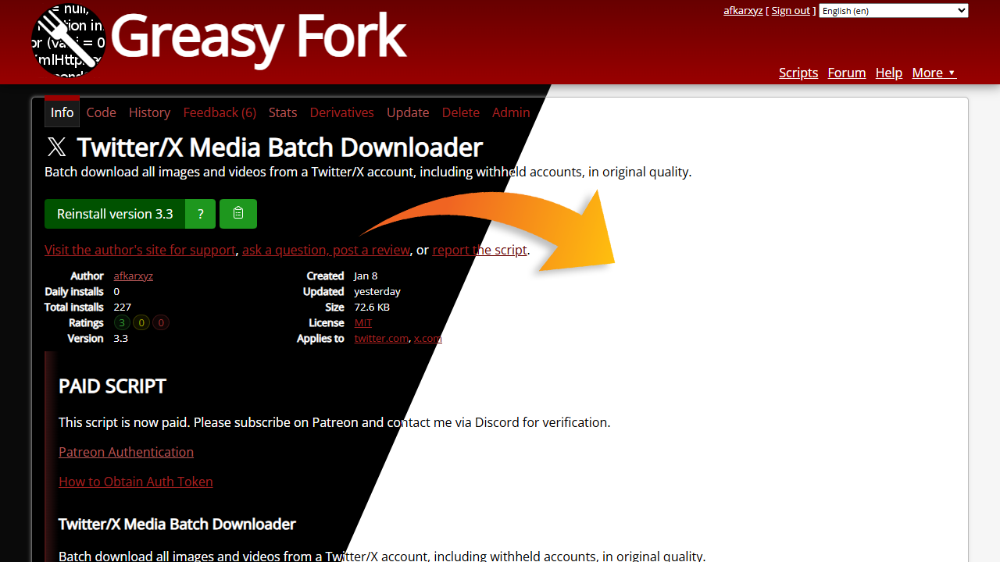

#### Greasy Fork User Profile ZIP Downloader

Adds a button to Greasy Fork user profiles for downloading every listed userscript and userstyle in a single ZIP archive, including scripts across paginated profile pages.

